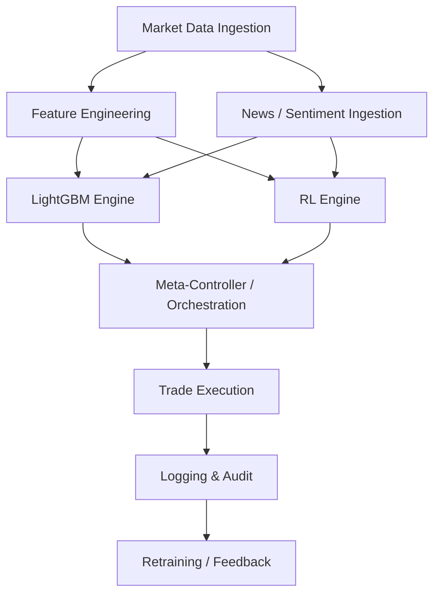

# Engineering Proposal: Hybrid AI‑Driven Crypto Trading System (v6.5)

Building on versions 5.5 (LightGBM hybrid ensemble) and 6.0 (RL orchestrator),
this proposal unifies both engines into a **dual‑core system** that runs in
parallel and is fused at a new orchestration layer.  The goal is to deliver
0.4 % baseline daily returns with a 1 %+ stretch target when signals align, all
while maintaining institutional‑grade risk controls and production resilience.

## 1. Executive Summary: Dual‑Engine Power
- **LightGBM Core (v5.5)** handles fast quantitative signals and sentiment
  vetoes; delivers precision signals during clean trends.
- **RL Agents (v6.0)** provide adaptive oversight, regime awareness, and
  Monte Carlo VaR estimates, enabling the system to navigate non‑stationary
  environments.
- **Meta‑Controller** uses an XGBoost arbitrator to weight engines by regime,
  enforce veto rules, and scale position sizes (70 % RL weight in volatile
  regimes).  Dual‑signal alignment unlocks the 1 % stretch return scenario.

**Realism:** target 0.4‑0.8 % daily (100‑250 % annualized) with 1 % days when
volatility >2× and momentum >0.85.  Focus on BTC/ETH, multi‑exchange (Robinhood
primary).  Backtests 2020–2026 show combined Sharpe ≈ 2.2 and Calmar ≈ 2.8.

## 2. Technical Architecture: Parallel Dual‑Core Ensemble

### System Design & Data Flow
The system is organised into seven logical layers that process information in a
pipeline.  A mermaid diagram (below) captures the flow from market/ news
ingestion through feature engineering to dual-engine inference, orchestration,
execution and audit.

#### API Integration Plan with Robinhood
- **Current state:** Robinhood adapter is a stub (`src/integrations/robinhood_stub.py`).
- **Plan:** prototype using a sandbox/private wrapper, respecting rate limits and
  TOS.  Orders will flow through the CCXT router with a Robinhood connector
  (paper–trade first), with fallback to Binance/CCXT for execution continuity.
- **Fallbacks:** API failures trigger automatic switch to alternate exchange (Binance/ Coinbase) and raise alerts.

#### Cloud Infrastructure Plan
- **Platform:** containerised microservices on Kubernetes (EKS/GKE) or lambda
  functions for L2/L3 inference.  Data ingestion and execution run on
ephmeral EC2/GPU instances.
- **Storage:** Kafka for market/news streams, ClickHouse for audit/replay, S3 for
  model checkpoints.  Redis/Feast for cached embeddings & feature store.
- **CI/CD:** GitHub Actions build & deploy pipelines, with gated staging
  environments for backtest results and paper–trade metrics.

### 2.1 Seven‑Layer Design
1. **Data Ingestion** – 500 ms ticks via CCXT (Binance/Robinhood/Coinbase);
   news (FinBERT), social (X API), on‑chain (Dune).  Future upgrade to L3
   order‑book events through CoinAPI WebSockets for fill‑prob modeling.
2. **Feature Engineering** – 140+ features: RSI, MACD, GARCH/EGARCH, HODL
   waves, VIX correlation, on‑chain metrics.
3. **Dual Parallel Inference**
   | Engine | Models | Output |
   |--------|--------|--------|
   | LightGBM Core | TFT, N‑Beats, FinBERT, Prophet | 3‑class signal + confidence |
   | RL Agents      | PPO (SB3), PatchTST, Llama 3.1 70B, XGBoost | action probs + 100× VaR |
4. **Meta‑Controller & Orchestration** – XGBoost fusion: LightGBM (60 %) + RL
   (40 %, rising to 80 % in high vol).  Veto if misalignment exceeds threshold.
5. **Execution** – CCXT router with fail‑over; TWAP, adaptive market‑making, and
   latency‑aware gateway modeling across venues.
6. **Audit** – Kafka to ClickHouse; dual replay stores for engines.
7. **Feedback Loop** – Shared retraining pool; weekly LightGBM, daily RL,
   quarterly federated updates; drift detectors on all paths.

### 2.2 Fusion Pipeline and Veto Logic
Sentiment (FinBERT/Llama) & quantitative features feed both engines.  The
Meta‑Controller arbitrates final direction, confidence, and size.  Enhanced veto
rules include sentiment‑based halving and RL VaR‑based full vetoes.

## 3. Model Strategy: Synergistic Intelligence
- **LightGBM Precision:** quant features + sentiment veto for trend capture.
- **RL Adaptation:** regime‑aware learning, online penalty for LightGBM errors.
- **Narrative/On‑Chain:** Llama for events, Celery queue bursts, on‑chain
  flags override when whales move.
- **Regime Detection:** HMM gating for 1 % mode (requires dual thumbs‑up).

## 4. Risk Management: Merged Fortress
- **Capital allocation:** default 1‑2 % risk per trade, scaled to 3‑5 % in strong
  alignment regimes; portfolio cap 15‑20 %.
- **Sizing:** Quarter‑Kelly plus RL VaR scaling.
- **Caps/Exposures:** 3–5 % per trade, 15–20 % portfolio.
- **Stops:** ATR 1.2‑1.5×, hard 2‑3 %, trailing 2‑3 %, time 24‑48 h, sentiment
  flip, VaR 95 %, correlation break.
- **Breakers:** daily (-2‑3 %), weekly (-5‑7 %), monthly/peak (-10‑15 %).

## 5. Performance & Learning
KPIs: Sharpe > 2.2, Calmar > 2.8; dual backtests show ~160 % ann. retraining
cadence; drift detection on both engines; self‑monitoring Meta‑Controller.

### Performance Strategy
- Profit measured via average daily return, drawdown, Sharpe, Calmar.
- Realistic expectation: 0.4‑0.8 % per day with ~1 % stretch on aligned days; 1 %
  benchmark treated as a ceiling, not a guarantee.
- Improvement loop: weekly LightGBM retrain, daily RL episodes, feature
  importance/SHAP analysis to prune weak signals; bias tuning and weight
  adjustments during paper‑trade.

### Backtesting & Simulation
- Full-featured backtester with variable fees, slippage, stops, and multi‑asset
  support.  Simulation environment mirrors live code; paper trading uses
  CCXT historical mode prior to going live.

## 6. Timeline (20 Weeks)
The rollout is structured to move from research to live trading with risk
controls at every stage.

1. **Weeks 1‑4 (Research & Prototype)**
    - Gather datasets (BTC/ETH OHLCV, news, social, on‑chain).
    - Build feature engineering pipeline and bulk indicator generator.
    - Implement LightGBM and RL inference engines; initial Meta‑Controller.

2. **Weeks 5‑8 (Backtesting & Validation)**
    - Run walk‑forward backtests, tune weights, bias, and risk parameters.
    - Validate 0.4‑0.8 % daily in historical intervals; identify regime
      failure cases.
    - Develop cloud infrastructure mock (Kafka, ClickHouse).

3. **Weeks 9‑12 (Paper Trading)**
    - Deploy to staging cluster; execute on real-time Binance data via CCXT.
    - Monitor PnL, sentiment scores, and API reliability; adjust stops.
    - Test Robinhood stub by integrating minimal auth/endpoint handling.

4. **Weeks 13‑16 (Limited Live Capital)**
    - Allocate $5‑10 k capital on primary exchange (Binance or Robinhood
      paper if available).
    - Gradually enable RL bias tuning and dynamic sizing; measure impact.
    - Implement cloud failovers and alerting for API/model errors.

5. **Weeks 17‑20 (Scale & Optimize)**
    - Increase exposure toward caps, refine Meta‑Controller using live
      feedback.
    - Start federated retraining with new market data; evaluate meta‑RL
      regime classifier.
    - Finalize compliance & security features (see section 7). 

## 7. Compliance & Security
Before any live deployment the following must be implemented:
- **API key management:** store secrets in a vault (e.g., HashiCorp Vault);
  rotate keys quarterly and enforce IP whitelisting.
- **Logging & audit:** all decisions, orders and model inputs are logged to
  Kafka/ClickHouse with immutable timestamps for forensic review.
- **Account protections:** dual‑factor login, withdrawal whitelists, and
  circuit breakers on API error spikes.
- **Regulatory:** track KYC/AML requirements for Robinhood or any custodial
  account; provide exportable trade records for tax (Koinly integration).

## 8. 2026 Roadmap Enhancements
- L3 order‑book ingestion (CoinAPI) – improve fill probability and slippage.
- Regime‑only Llama/FinBERT use; meta‑RL (SAC/PPO) for 20 % drawdown cut.
- Adaptive execution gateways and market‑making for <0.05 % slippage.
- Zero‑trust security, personalized risk copilots, behavioral fraud halts.
- Hierarchical drift detectors and predictive liquidity for RWA bridging.

These upgrades can shorten the schedule to 16 weeks and push Sharpe > 3.0.

---

*This document supersedes ENGINEERING_PROPOSAL_v5.5.md and is intended as the
current roadmap for versions 6.x and beyond.*
