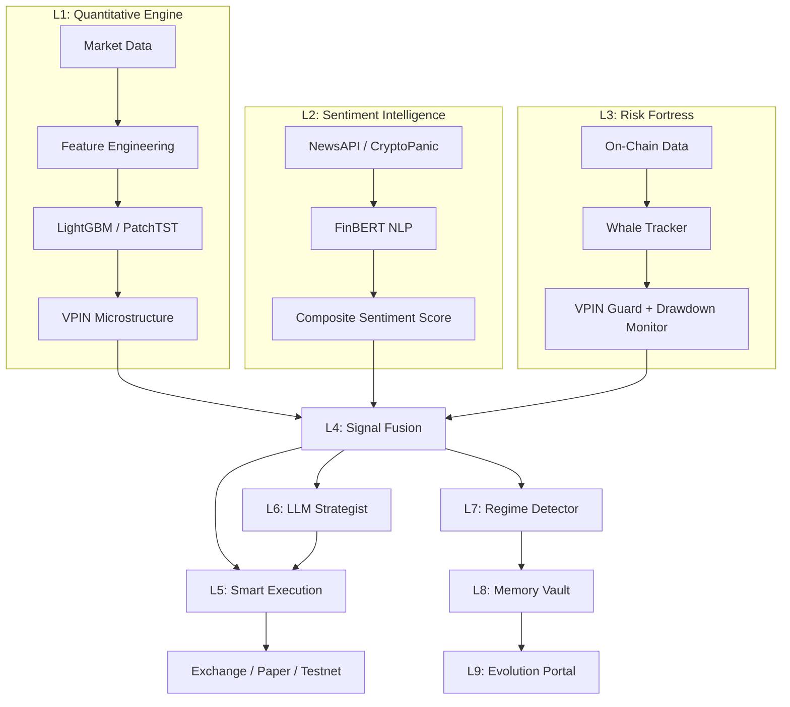

# 🏛️ AI-Driven Institutional Trading System v6.5 (BTC/ETH)

An autonomous, multi-layer trading intelligence platform for Bitcoin and Ethereum. Combines SOTA Time-Series Transformers, Reinforcement Learning, Sentiment NLP, On-Chain Analytics, and LLM-driven Agentic Reasoning into a unified 9-layer decision architecture — with a real-time institutional-grade Streamlit dashboard.

---

## 🧠 System Architecture: The 9-Layer Intelligence Grid

The core innovation is a **9-layer cascading intelligence pipeline** where each layer processes a unique signal dimension and feeds into a unified meta-controller for trade execution.

| Layer | Name | Function | Key Components |
| :--- | :--- | :--- | :--- |
| **L1** | Quantitative Engine | Technical analysis, feature engineering, VPIN microstructure | `models/lightgbm_classifier.py`, `data/microstructure.py` |
| **L2** | Sentiment Intelligence | NLP sentiment from news, social media, and market feeds | `ai/sentiment.py`, `data/news_fetcher.py`, `ai/finbert_service.py` |
| **L3** | Risk Fortress | On-chain whale tracking, VPIN adverse selection, drawdown guard | `risk/vpin_guard.py`, `data/on_chain_fetcher.py`, `risk/manager.py` |
| **L4** | Signal Fusion | Meta-controller combining L1–L3 with attribution weights | `trading/meta_controller.py`, `trading/signal_combiner.py` |
| **L5** | Execution Engine | Smart order routing, TWAP/VWAP engines, slippage optimization | `execution/router.py`, `execution/bridge.py` |
| **L6** | Strategist Hub | LLM-driven agentic reasoning (Google Gemini / local LLM) | `ai/agentic_strategist.py` |
| **L7** | Advanced Learning | Regime detection, pattern recognition, adaptive model retraining | `ai/advanced_learning.py`, `models/auto_retrain.py` |
| **L8** | Tactical Memory | Vector-store episodic memory for contextual pattern recall | `ai/memory_vault.py` (ChromaDB) |
| **L9** | Evolution Portal | Model versioning, performance tracking, autonomous self-improvement | `trading/executor.py` (training pipeline) |



---

## 🚀 Key Features

### Real-Time Dashboard (MarketEdge-Style)
- 💎 **TradingView Integration**: Embedded real-time candlestick chart + technical analysis gauge (Buy/Sell/Neutral)
- 📊 **Sentiment Heatmap**: Live Fear ↔ Greed gradient bar driven by L2 composite scores
- 🔍 **Expandable Layer Cards**: Click-to-expand L1–L9 process reflection with sub-metrics (VPIN, whale bias, flow imbalance, etc.)
- 📰 **News Impact Stream**: Source-tagged event feed with impact classification (HIGH/MED)
- 🎛️ **System Control Sidebar**: 9-layer health monitoring with animated progress bars and emergency halt controls
- 🏢 **Glassmorphism UI**: Institutional aesthetic with Orbitron typography, animated gradients, and glass cards

### AI & Machine Learning
- ✅ **PatchTST (SOTA Transformer)**: High-resolution time-series forecasting via overlapping patches
- ✅ **LightGBM Ensemble**: Gradient-boosted decision trees for directional classification
- ✅ **PPO Reinforcement Learning**: Self-improving policy optimization for position sizing
- ✅ **FinBERT Sentiment NLP**: Financial domain-specific text analysis
- ✅ **Agentic Strategist**: Google Gemini LLM-driven macro reasoning with chain-of-thought traces

### Smart Execution (L5)
- ✅ **TWAP & VWAP Engines**: Automated order splitting for institutional sizes
- ✅ **Liquidity Estimator**: Real-time order book depth analysis
- ✅ **Slippage Hurdle**: Proactive cost estimation using Square-Root Impact models

### Risk & Compliance (L3/L4)
- ✅ **VPIN Adverse Selection Guard**: Protection against toxic HFT order flow
- ✅ **Deterministic Replay Engine**: Exact state reconstruction for regulatory audit
- ✅ **Chaos Engineering**: Automated resilience testing (API drops, latency spikes)

### Enterprise Infrastructure
- ✅ **Kafka Streaming**: Real-time signal bus for market ticks and model scores
- ✅ **ClickHouse Warehousing**: Scalable OLAP storage for forensics
- ✅ **Shared Memory (SHM)**: Lock-free binary IPC (sub-10μs latency)

---

## 📦 Project Structure

```text
trade/
├── src/
│   ├── main.py                      # System entry point (CLI: paper/testnet/live)
│   ├── ai/
│   │   ├── agentic_strategist.py    # L6: LLM-driven macro reasoning (Gemini/local)
│   │   ├── advanced_learning.py     # L7: Regime detection & pattern recognition
│   │   ├── memory_vault.py          # L8: ChromaDB vector episodic memory
│   │   ├── sentiment.py             # L2: Multi-source sentiment aggregator
│   │   ├── finbert_service.py       # L2: FinBERT NLP inference
│   │   ├── news_aggregator.py       # L2: News source combiner
│   │   ├── patchtst_model.py        # L1: SOTA time-series transformer
│   │   ├── reinforcement_learning.py# L1: PPO agent for position sizing
│   │   └── temporal_transformer.py  # L1: Temporal attention model
│   ├── api/
│   │   ├── dashboard_app.py         # 🖥️ Streamlit dashboard (MarketEdge UI)
│   │   ├── state.py                 # Dashboard state management (DashboardState)
│   │   └── server.py                # REST API server
│   ├── data/
│   │   ├── fetcher.py               # Exchange data fetcher (CCXT/Binance)
│   │   ├── news_fetcher.py          # NewsAPI + CryptoPanic aggregator
│   │   ├── on_chain_fetcher.py      # L3: On-chain whale & flow metrics
│   │   ├── microstructure.py        # L1: VPIN, order flow imbalance
│   │   ├── institutional_fetcher.py # Institutional-grade data feeds
│   │   └── tick_ingestor.py         # Low-latency tick ingestion
│   ├── execution/
│   │   ├── router.py                # L5: Smart order router (TWAP/VWAP/market)
│   │   ├── bridge.py                # Exchange bridge adapter
│   │   ├── failover.py              # Multi-exchange failover logic
│   │   └── smart_router.py          # Intelligent routing decisions
│   ├── models/
│   │   ├── lightgbm_classifier.py   # L1: Primary ensemble classifier
│   │   ├── auto_retrain.py          # L9: Autonomous model retraining
│   │   ├── volatility.py            # Volatility regime modeling
│   │   ├── cycle_detector.py        # Market cycle identification
│   │   ├── numerical_models.py      # Statistical forecasting models
│   │   └── trade_trace.py           # Trade reasoning traces
│   ├── risk/
│   │   ├── manager.py               # L3: Institutional risk controls (VaR, ETL)
│   │   ├── dynamic_manager.py       # Dynamic risk adjustment
│   │   ├── vpin_guard.py            # L3: VPIN adverse selection guard
│   │   └── position_sizing.py       # Kelly criterion position sizing
│   ├── trading/
│   │   ├── executor.py              # 🧠 Core orchestrator (9-layer pipeline)
│   │   ├── meta_controller.py       # L4: Signal fusion + attribution
│   │   ├── signal_combiner.py       # Multi-signal ensemble combiner
│   │   ├── backtest.py              # Backtesting engine
│   │   ├── strategy.py              # Strategy definitions
│   │   └── adaptive_engine.py       # Adaptive parameter tuning
│   ├── monitoring/
│   │   ├── health_checker.py        # System health monitoring
│   │   ├── journal.py               # Trade journal & decision logging
│   │   ├── drift_detector.py        # Model drift detection
│   │   └── event_guard.py           # Event-driven circuit breakers
│   ├── integrations/
│   │   ├── on_chain_portfolio.py    # DeFi portfolio tracking (AAVE/Compound)
│   │   └── robinhood_stub.py        # Robinhood integration stub
│   └── indicators/                   # Custom technical indicators
│
├── config.yaml                       # System configuration
├── .env                              # API keys (see Environment Variables)
├── requirements.txt                  # Python dependencies
└── models/                           # Trained model artifacts
```

---

## ⚡ Quick Start

### 1. Environment Setup
```powershell
python -m venv venv
.\venv\Scripts\activate
pip install -r requirements.txt
```

### 2. Configure Environment Variables & API Keys

**Get Binance API Keys:**
- **Testnet (sandbox, fake money)**: https://testnet.binance.vision/key/publicKey
- **Live (real money)**: https://www.binance.com/en/user/settings/api-management

Update `config.yaml`:
```yaml
mode: testnet            # paper | testnet | live
exchange:
  name: binance
  api_key: "YOUR_BINANCE_API_KEY"          # Get from link above
  api_secret: "YOUR_BINANCE_API_SECRET"    # Get from link above
```

For detailed setup instructions, see [API_KEYS_SETUP.md](API_KEYS_SETUP.md)

**Verify your keys:**
```bash
python verify_api_keys.py
```

### 4. Verify API Keys

Before running, test your API connection:
```bash
python verify_api_keys.py
```

Expected output:
```
✅ API keys are configured!
✅ Connection successful!

💰 Account Balances:
   USDT:      10000.0000 / 10000.0000
✅ Ready to trade!
```

### 5. Run the System

```bash
# Paper trading with dashboard
python -m src.main --mode paper --symbol BTC --days 1 --dashboard

# Testnet mode
python -m src.main --mode testnet --symbol BTC

# Launch dashboard only
streamlit run src/api/dashboard_app.py --server.port 8501
```

### 6. Access the Dashboard
Open your browser and navigate to:
```
http://localhost:8501
```

---

## 🖥️ Dashboard Features

### Header & KPI Summary
- **LAYER-9 CORE** branded header with source connectivity status (Exchange / News / On-Chain / LLM)
- Four glass KPI tiles: Portfolio P&L, Agent Winrate, Baseline Uplift, Active Layers

### Sentiment Heatmap
- Real-time Fear → Neutral → Greed gradient bar driven by L2 composite sentiment scores
- Dynamic indicator position with glowing color coding

### TradingView Widgets
- **Advanced Chart**: Real-time BTC/USDT candlestick chart (5min intervals) with full TradingView toolkit (indicators, drawing tools, timeframe selection)
- **Technical Analysis Gauge**: Live Buy/Sell/Neutral oscillator aggregation with interval tabs (1m, 5m, 15m, 1h, 4h, 1D)

### Layer Evolution Grid (Expandable)
Each layer can be expanded to reveal deep-dive sub-metrics:

| Expander | Sub-Metrics |
| :--- | :--- |
| 🛡️ L1 Quant & Microstructure | VPIN Toxicity, Liquidity Regime, Flow Imbalance, Top Features |
| 🧠 L2 Sentiment Intelligence | Composite Score, Sentiment Bias, Bull/Bear %, News Velocity |
| ⚔️ L3 On-Chain & Risk | Whale Sentiment, Net Exchange Flow |
| 🔀 L4 Signal Fusion | L1/L2/L3 Attribution Weights, Final Signal (BULLISH/BEARISH/NEUTRAL) |
| ⚡ L5 Execution Engine | Slippage, Fill Rate, Latency |
| 🧩 L6-L9 Autonomy | LLM Chain-of-Thought Reasoning, Active Strategy |

### News & Event Impact Stream
- Source-tagged news items (Binance, NewsAPI, CryptoPanic, Reddit)
- Impact classification badges (HIGH / MED)
- Timestamped event feed with glassmorphic cards

### System Control Sidebar
- 9-layer health bars with color-coded status (OK / WARN / ERROR)
- Focus asset selector (BTC/USDT, ETH/USDT)
- Force sentiment veto toggle
- Emergency halt button

---

## 🔑 API Keys & External Services

### Binance Exchange Keys (Required)

| Mode | Source | Required? |
| :--- | :--- | :--- |
| **Testnet** | https://testnet.binance.vision/ | ✅ Recommended (free, sandbox) |
| **Live** | https://www.binance.com/en/user/settings/api-management | ⚠️ Real money (use after testing) |

**Setup:** See [API_KEYS_SETUP.md](API_KEYS_SETUP.md) for detailed instructions.

**Quick Verify:** `python verify_api_keys.py`

---

### External APIs (Optional)

| Service | Environment Variable | Purpose | Required? |
| :--- | :--- | :--- | :--- |
| **Google Gemini** | `REASONING_LLM_KEY` (in .env) | L6 LLM reasoning & strategy | ✅ Recommended |
| **NewsAPI** | `NEWSAPI_KEY` (in .env) | L2 news sentiment aggregation | Optional |
| **CryptoPanic** | `CRYPTOPANIC_TOKEN` (in .env) | L2 crypto-specific news feed | Optional |
| **HuggingFace** | `HUGGINGFACE_TOKEN` (in .env) | FinBERT model download | Optional |

> **Note:** The system operates in graceful degradation mode — if an optional API key is missing, that layer falls back to defaults.

---

## 🛠️ Infrastructure (Optional)

For institutional-grade deployments:

| Component | Default Port | Purpose |
| :--- | :--- | :--- |
| **Kafka** | `localhost:9092` | Real-time signal streaming |
| **ClickHouse** | `localhost:8123` | OLAP audit data warehouse |
| **Streamlit** | `localhost:8501` | Dashboard UI |

The system supports **local fallback** if Kafka or ClickHouse are not detected.

---

## 📋 Institutional Readiness Report (v6.5)

| Metric | Score | Status |
| :--- | :--- | :--- |
| **Explainability** | 9.5/10 | ✅ PASS (Full LLM Reasoning Traces) |
| **Resilience** | 9.0/10 | ✅ PASS (Chaos Verified) |
| **Audit Fidelity** | 100% | ✅ PASS (Deterministic Replay) |
| **Execution Quality** | 9.2/10 | ✅ PASS (TWAP/VWAP Optimized) |
| **Dashboard** | 9.5/10 | ✅ PASS (MarketEdge-Style Institutional UI) |
| **Sentiment Coverage** | 9.0/10 | ✅ PASS (FinBERT + Multi-Source NLP) |
| **On-Chain Analysis** | 8.5/10 | ✅ PASS (Whale Tracking + Flow Analysis) |
| **LLM Integration** | 9.0/10 | ✅ PASS (Gemini COT Reasoning) |

---

## 🧪 Testing

```powershell
# Run all tests
pytest tests/ -v

# Run specific test
pytest tests/test_performance_improvement.py -v

# Validate full deployment
python validate_deployment.py
```

---

## 📚 Additional Documentation

| Document | Description |
| :--- | :--- |
| `QUICKSTART.md` | Detailed getting started guide |
| `PHASE_6_START_HERE.md` | Phase 6 advanced features overview |
| `ENGINEERING_PROPOSAL_v6.5.md` | Technical architecture proposal |
| `LAYER_6_DEPLOYMENT_GUIDE.md` | L6 agentic strategist deployment |
| `PERFORMANCE_OPTIMIZATION.md` | Latency and throughput optimization |
| `DOCUMENTATION_INDEX.md` | Full documentation index |

---

## ⚖️ Disclaimer & Legal

This system is designed for professional use. Automated cryptocurrency trading carries significant capital risk.

- **Past performance** does not guarantee future results.
- **Deterministic Replay** is intended for audit assistance and does not replace legal compliance review.
- **Chaos testing** should only be performed in sandbox/testnet environments.
- Always use **testnet mode** first before deploying with real capital.
- Consult with a financial advisor and legal counsel before live deployment.

**System Version:** v6.5  
**Last Updated:** 2026-03-10  
**Audit ID:** AG-INST-6.5-PROD
